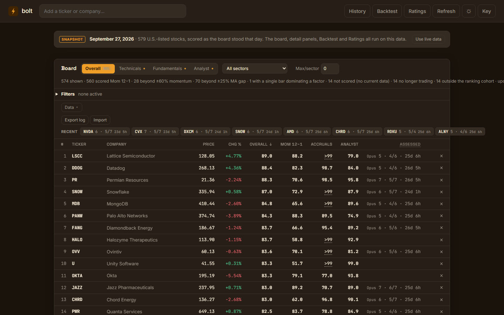

# Bolt: A Multi-Factor Stock Screener

**Live app:** https://FedeMora1.github.io/bolt/



Bolt is a multi-factor stock screener: it scores 579 U.S.-listed stocks three independent ways, shows how much evidence stands behind each score, and tests its own scores. I built it to research swing-trade ideas and picks for my school's student-led investment fund.

## What's in it

**Four tabs.** The board has one tab per way of scoring a stock, plus one that combines them:

- **Overall:** the average of the other three tabs' headline scores, one third each. It ranks stocks against each other on this board, so an Overall score isn't comparable across days.
- **Technicals:** price-based scores computed from two years of daily prices. The headline score is 12-month momentum (the past year's return, skipping the most recent month). Also scored: 6-month momentum, low volatility, three ways of combining momentum with volatility (two averages and a banded version), a momentum ranking with the most volatile tenth removed, and an experimental support-level score. RSI, distance from the 200-day average, 52-week position and maximum drawdown are shown for reference but aren't scored.
- **Fundamentals:** earnings yield, book-to-market, return on equity and accruals (how much of a company's profit is backed by cash), computed from SEC filings. Each figure is stored as it was *first* filed, so the numbers are what investors could actually have known at the time.
- **Analyst:** Wall Street buy/hold/sell ratings, adjusted for how many analysts cover the stock, which way opinion is moving, and how much the analysts agree. Explained in detail below.

**Backtest.** For each price-based score, Bolt goes back to past dates, scores every stock using only the prices available up to that date, splits the stocks into fifths by score, and measures what each fifth returned afterward against the S&P 500 (SPY). It reports risk-adjusted returns (Sharpe ratios) as well as raw returns.

**AI Ratings calibration.** Each stock can get a written research brief from an AI model, which also rates the stock 1 to 10. The Ratings view checks those ratings against the stock's later returns and against the rest of the board, and shows standard errors beside every figure so noise isn't mistaken for a result.

**Evidence labels.** Every score carries a status: *external* (backed by published research, but not yet confirmed on this board), *untested* (built here, not yet measured), *validated*, or *failed*. A failed score is removed from sorting, filtering, the backtest and Overall. Right now no score is labelled validated or failed. The label and the reasoning behind it appear in each stock's detail panel.

**Test suite.** More than 300 automated tests check the scoring math, the backtest (including that no future price can leak into a past score), the data handling and the privacy of the published snapshot. Browser tests (Playwright) load the site the way a visitor would and click through it.

**Try it with no setup.** The live link opens on a **dated snapshot** of the full board, with real companies and real scores. To load live data instead, click **Use live data** and paste a free API key.

## How the Analyst score works

Analyst ratings are converted to a 1–5 scale (5 = Strong Buy, 1 = Strong Sell). Each stock's composite score starts from that consensus and adjusts it:

**1. Level: coverage-weighted consensus.** A rating from a handful of analysts is pulled toward the market-wide average (3.8) before it's trusted. The fewer analysts, the stronger the pull:

```
level = (n × raw + 5 × 3.8) / (n + 5)
```

A stock with 60 analysts keeps about 92% of its own rating; a stock with 3 is pulled more than halfway (62.5%) toward the average. This is a statistical technique called *shrinkage*, and it stops thinly covered stocks from floating to the top on one or two opinions.

**2. Momentum: which way opinion is moving.** The change in that level since about three months earlier (the oldest of the four monthly records the data provider supplies). Capped at ±0.25, so it can break ties between similar stocks but can never override the rating itself.

**3. Agreement: how unified the analysts are.** Stocks where analysts broadly agree get a small boost; split opinions get a penalty. The adjustment runs from +0.125 (every analyst gives the same rating) down to −0.375 (analysts split evenly between Strong Buy and Strong Sell), so disagreement can cost three times what agreement can earn.

The code also has a price-target term, but the free data plan doesn't provide price targets, so it currently contributes nothing. The composite is kept within 1–5. On the board it's shown as a percentile (0–100) across all stocks, because the top names differ by only hundredths of a rating point. Each stock's detail panel shows the calculation term by term, so any ranking can be checked by hand.

## What I learned

The model went through several versions, and the most useful lessons came from its mistakes.

In one version, momentum was multiplied by 3 and capped at ±1.0, so it could move a score by up to 3 full points. CF Industries, a stock most analysts rated **Hold**, jumped to **#1** with a score of 5.19, which is impossible on a 1–5 scale. I caught it by comparing the top of my rankings against an outside brokerage's ratings. The cause: analysts had moved from fairly negative to neutral on CF, and the model was rewarding the *change* more than the actual opinion. That led to the current design: the consensus is the base, and every other signal is a small, capped adjustment.

The bigger takeaway is that adding inputs doesn't make a model more accurate. Each one has to be weighted in proportion to how much it should matter, and checked against reality.

## Is it accurate?

No score on the board has shown that it predicts returns. That's what has been measured so far (September 2026):

- **Price-based scores:** the stored price history is two years deep, which gives the 12-month scores exactly one independent six-month test window. In that window, the top fifth by 12-month momentum returned 15.25% against the S&P 500's 13.08%, but it took on more risk to do it, and on a risk-adjusted basis (Sharpe 1.63 against 1.84) it trailed the index. The best risk-adjusted result, 6-month momentum, was ahead of the index by 0.09, which is too small to mean anything on one window. The differences between the scores sit well inside what a single window can resolve.
- **Fundamentals:** tested on two windows, scoring each stock only from filings available at the time. Every one of the four fundamentals scores flipped sign between the two windows: a score that picked winners in one picked losers in the other.
- **Analyst score:** it can't be backtested at all, because the data provider only serves the last four months of ratings. Bolt archives each month's ratings as they're first seen (kept for up to ten years per stock), so a forward test becomes possible as the archive grows.
- **AI ratings:** across 79 rated assessments, the AI's 1–10 rating correlates +0.60 (±0.11) with the board's own combined score, so it largely restates numbers the board already shows. All 80 ratings fall between 3 and 8, and none has reached 9 or 10, so the calibration view's headline comparison (top ratings against bottom ratings) can't be computed yet.
- **Overall:** it has never been tested.

Until these tests say otherwise, the board is a way to organize and question information, not a source of predictions.

## Using it

**Online:** the live link opens on the snapshot, which needs no key. It shows the date it was taken, and the board, detail panels, Backtest and Ratings views all run on it. (The History view shows only records made in your own browser, so it starts empty.) For live data, click **Use live data** and enter your own free API key from [finnhub.io](https://finnhub.io). The key is stored only in your browser. A live first load of all 579 stocks takes roughly 20–30 minutes because of the free tier's rate limit; after that, prices are cached for 24 hours and analyst ratings for 7 days. Live mode on the website covers analyst data, plus the price-based scores if you also add a free [Polygon](https://polygon.io) key. Fundamentals and AI briefs need the local version.

**Locally:** requires [Node.js](https://nodejs.org/). Clone the repo, set your Finnhub key as an environment variable, then run `Bolt.bat` (Windows) or `node serve.mjs` and open http://localhost:8080. Local mode adds fundamentals from SEC filings and the AI research briefs (which need your own Anthropic API key in `BOLT_ANTHROPIC_KEY`).

```
git clone https://github.com/FedeMora1/bolt.git
cd bolt
setx FINNHUB_API_KEY "your-key"
```

Close and reopen the terminal after `setx`, then start `Bolt.bat`.

Detailed technical documentation is in [docs/TECHNICAL.md](docs/TECHNICAL.md).

## Built with

Plain HTML, CSS, and JavaScript, with no frameworks, plus a small dependency-free Node.js server for local mode. Data: Finnhub (analyst ratings, quotes, insider trades), Polygon (price history), SEC EDGAR (financial statements), and Anthropic (AI briefs). I designed the scoring model and directed the build, and used AI coding tools (Claude Code) to write much of the code.

## Disclaimer

Bolt is a research and learning project, not investment advice. The snapshot's AI briefs and ratings are one model's summaries of public information on the day they were written.
